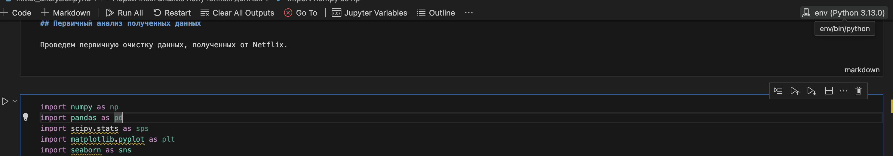

## Тестовый проект команды FlexML на анализ датасета Netflix


## Getting started
```
    1. python3 -m venv env
    2. source env/bin/activate
    3. pip3 install -r requirements.txt
```

Tutorial по работе с VSCode + jupiter: https://code.visualstudio.com/docs/datascience/jupyter-notebooks <br>
Для запуска - убедиться, что kernel выбран именно (env) Python (иначе либы не заимпортируются!)


<br>
Референс: EDA занятие: https://colab.research.google.com/drive/1aqelxwiUMAx51pPChMkmix-rbYqcfn3c?usp=sharing <br>


Презентация<br>
https://docs.google.com/presentation/d/1F3qeTUeHTe7bLKdxOwyKGXOyxeRd_ru9/edit?usp=sharing&ouid=112143014839736398757&rtpof=true&sd=true
